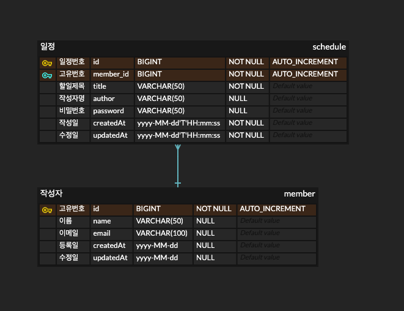

# CalenderApp

## API
[API 명세서](https://documenter.getpostman.com/view/39417056/2sB2j7fAmn)

## ERD

## 프로젝트 목표
Servlet을 사용하지 않는 SpringBoot 이해
Controller, Service, Repository 3계층을 사용하여 설계원칙 DI, IOC을 경험
Spring Boot에 내장되어 있는 Tomcat을 상기하며 Spring Boot프레임워크 이해
JDBC 사용법 및 JDBC 동작과정 이해
